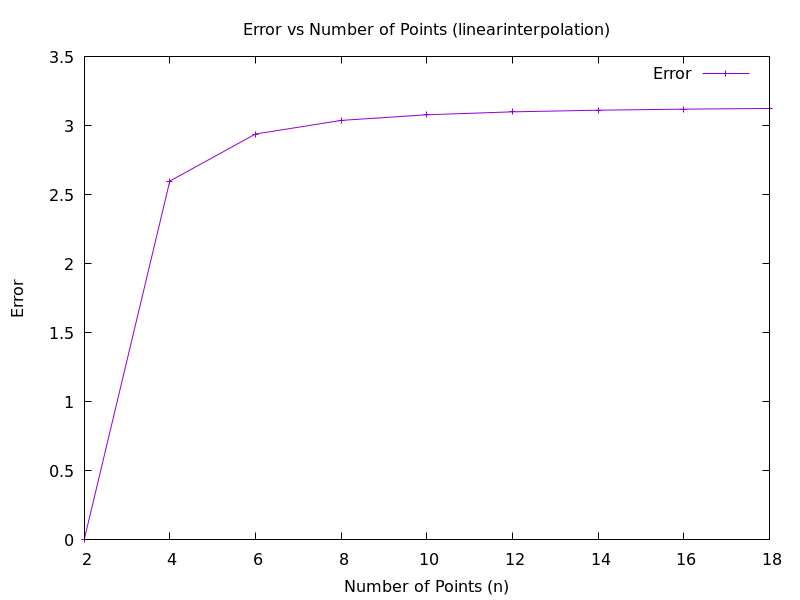
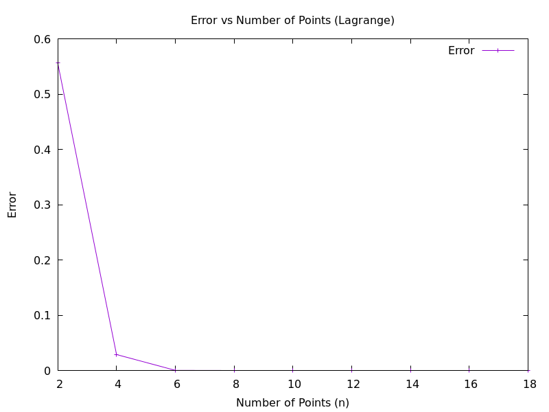
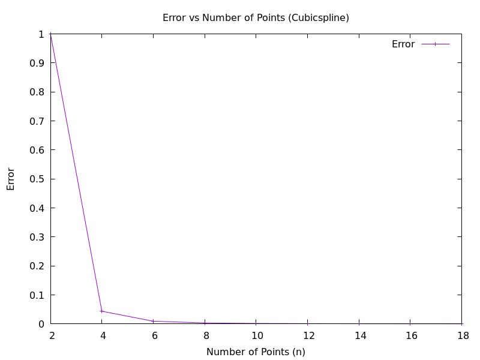

# ADVANCED PROGRAMMING HOMEWORK 2: Implementation of a Scientific Computing Toolbox

All files and folders for the second assignment of the Advanced Programming course at UniTS, A.2024/45.

## Group Members
- **Giovanni Billo**: billogiova@gmail.com
- **Tommaso Piscitelli**: s309639@ds.units.it

### Individual Contributions

#### Giovanni Billo
- Implementation of the entire statistics module.
- [Implementation of custom Visitors](https://htmlpreview.github.io/?https://github.com/hosseinmoein/DataFrame/blob/master/docs/HTML/DataFrame.html#5) for classification and interpolation.
- Tests for both modules.
- `CMakeLists.txt` configurations and code organization for both modules.

#### Tommaso Piscitelli
- Implementation of the entire interpolation module.
- Tests for the interpolation module.

---

## STATISTICS MODULE (Giovanni Billo)

This module consists of a wrapper that simplifies the usage of Hossein Moein's [DataFrame](https://github.com/hosseinmoein/DataFrame) library. This library is a high-performance data analysis tool that already implements many useful features. 

You can refer to the [library's documentation](https://htmlpreview.github.io/?https://github.com/hosseinmoein/dataframe/blob/master/docs/html/dataframe.html) for more information.

### Key Features
The module provides a generalized `DataFrameWrapper` class that:
- Hides technical complexities of the library while retaining its core functionality.
- Adds new features for enhanced usability.

**Input Format**:
DataFrame expects CSV files with headers formatted as:
```csv
"ColumnName":n_rows:<ColumnType>
```
The first column must be named `INDEX`. The wrapper automatically parses any CSV to the appropriate format via the `CSVparser` header. 

**Important Note**:
You must pass the type of the `INDEX` column as a template argument to the `DataFrameWrapper` class during initialization. Similarly, specify types for other columns when performing operations.

### Visitor-Based Functionality
The `DataFrame` library relies heavily on the `Visitor` class for operations on data, whose functioning is not easy to understand if not already somehow acquainted with the library. To address this, the wrapper implements several operations in a beginner-friendly, Python-like syntax, such as:
- Mean
- Median
- Standard deviation
- Correlation
- Frequency count
- Classification (custom visitor)
- Interpolation (custom visitor)

### Highlights
- The **classification** and **interpolation** functionalities were not available in the original library. Custom visitors were implemented based on Moein's guidelines.
- A real-world example of profit classification for a data from a superstore is demonstrated in `main.cpp`. It also serves as a general example on how to use the wrapper, showcasing the required syntax and different options to handle data.
- Comprehensive tests for custom functions and visitors are provided in a separate `tests` folder.

---

## INTERPOLATION MODULE (Tommaso Piscitelli)

This module wraps methods from the interpolation package of the [ALGLIB](https://github.com/hjkuijf/ALGLIB/tree/master) library, a versatile numerical analysis library. It includes:

### Key Classes
1. **LinearInterpolator**:
   - Implements piecewise linear interpolation.

2. **LagrangeInterpolator**:
   - Creates interpolating polynomials based on the type of input nodes (e.g., random, equidistant, Chebyshev).

3. **SplineInterpolator**:
   - Builds cubic spline interpolants using two input vectors (`x` and `y`).

The main and test files showcase how to use the Wrapper and its methods.

### Common Features
- **Operator Overloading**: 
  Each class overloads the `()` operator for pointwise evaluation of interpolants.
- **Error Evaluation**: 
  The `Error` method approximates the maximum error between the interpolant and the function.
- **Error Plotting**: 
  The `PlotError` function visualizes error convergence as the number of points increases.

### Convergence of Interpolation Methods

#### Linear Interpolation


#### Lagrange Interpolation (Chebyshev Nodes)


#### Spline Interpolation


Using the `PlotError` function, we compare interpolants as the number of points increases. **Observation**:
- For **Lagrange** and **Spline** methods, increasing the number of points reduces the error significantly.
- For **Linear** interpolation, the error does not decrease as effectively and may even increase.

---

## BUILD INSTRUCTIONS

A `CMakeLists.txt` file is provided for each module to handle the build process for:
- Working examples (main project folder).
- Test suites (tests folder).

### Basic Build Steps
Run the following commands in the relevant folder:
```bash
cmake -B build
cd build
make
```

### Build Options
- **`CMAKE_BUILD_TYPE`**:
  - `Debug` (default): Includes warnings and debug flags (not optimized).
  - `Release`: Optimized build without debug flags.
- **`DATA_DIR`**:
  - Specify a custom data directory for analysis. Defaults to `/data`, which already contains various datasets from different fields.
- **`INTERPOLATION_MODULE`**:
  - Decide whether or not to include the interpolation module as a custom visitor in the DataFrameWrapper class (not included by default).
  Pragma messages during compilation time will confirm if the module was actually included or if some error occurred.

#### Examples
```bash
cmake -B build -DCMAKE_BUILD_TYPE=Release -DDATA_DIR=/home/giovanni/example_custom_data_dir_path
cd build
make
```

This compiles a Release build with a specified custom data directory. Files will contain a `DATA_DIR` variable for referencing the directory in code.

---

```bash
cmake -B build -DCMAKE_BUILD_TYPE=Debug -DINTERPOLATION_MODULE=ON 
cd build
make
```

This compiles a Debug build referring to the default data directory in each of the folders, including the InterpolateWrapper module as a custom visitor. 
Files will contain a `DATA_DIR` variable for referencing the directory in code.

---


## COMPILER COMPATIBILITY

The code was tested with `g++` compilers and requires version 14 or higher to support modern C++ features(this requirement is checked by CMake automatically).

